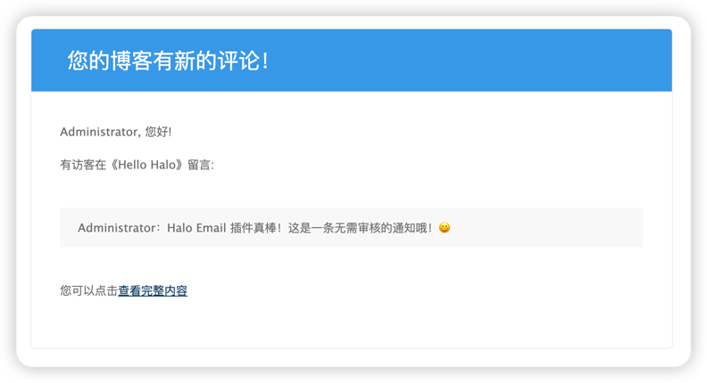
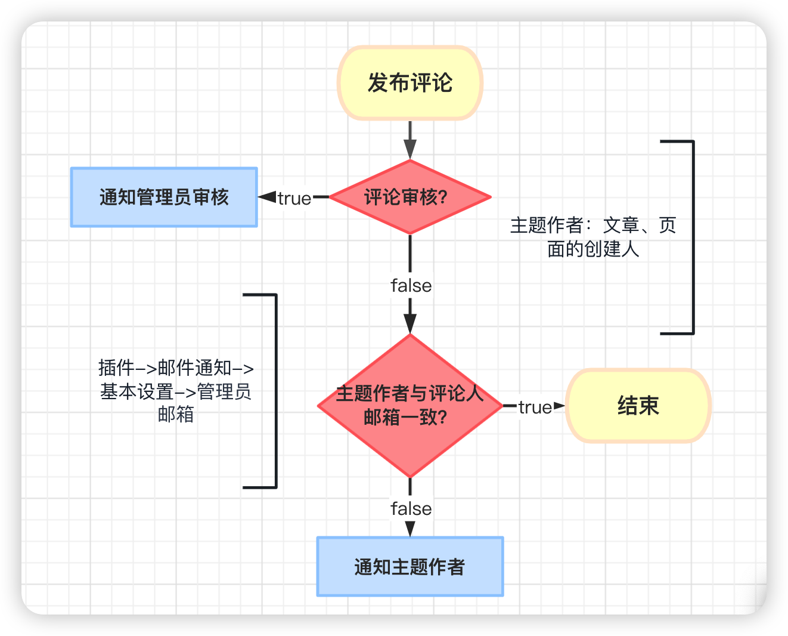
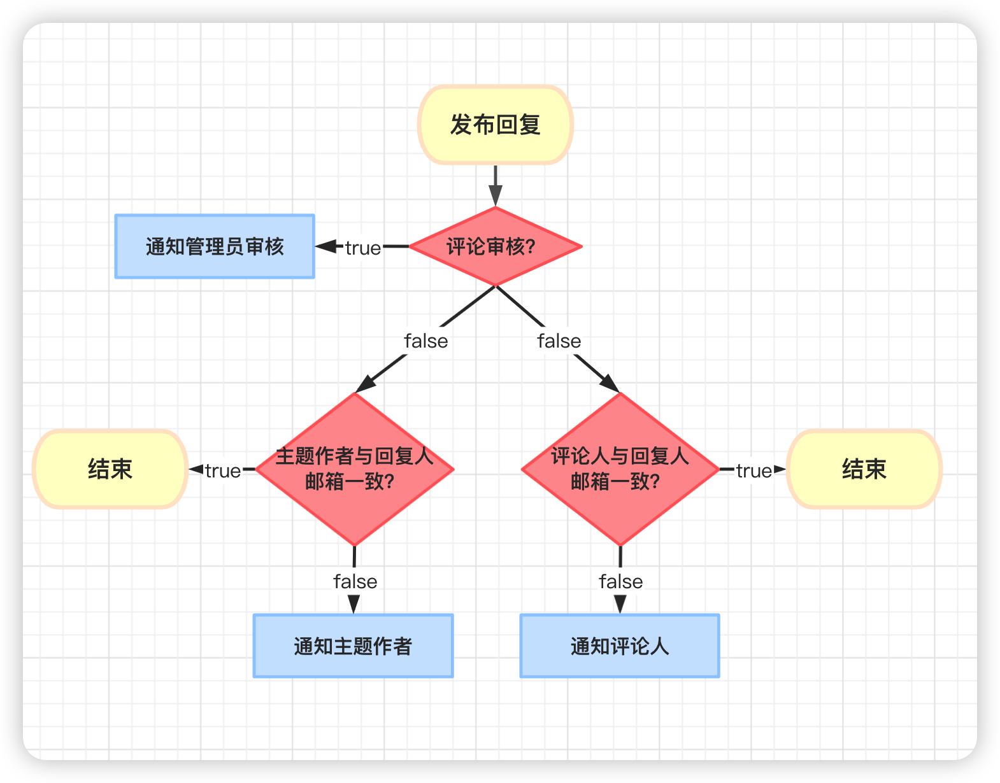

# halo-plugin-email

Email plugin for Halo2.0



## 功能

- [x] 新评论邮件通知
- [x] 为第三方插件提供邮件通知API
- [x] 评论审核邮件通知
- [x] 新回复邮件通知
- [ ] 文章审核通知
- [ ] 自定义通知模板

## 使用

1. Releases 下载最新版本
2. Halo 后台插件安装并启动
3. 进入 插件设置页面 配置邮件服务器信息
4. 调用接口测试连接(true为成功,每次修改配置都需要进行测试): `http://ip:port/apis/io.mvvm.halo.plugins.email/testConnection`

## 评论通知推送策略

- 评论通知流程



- 回复通知流程



## 第三方插件

邮件插件为第三方插件提供了API，可以自定义邮件发送逻辑

```java
MailHelper.publish(MailMessage message);
```

1. 添加插件的依赖(plugin.yaml)

```yaml
spec:
  pluginDependencies:
    "halo-plugin-email": ">=1.1.2"
```

2. 下载jar并引入

```groovy
compileOnly files("lib/halo-plugin-email-x.x.x.jar")
```

3. 发送式例

```java
SimpleMailMessage message = MailMessage.of("xxx@qq.com");
message.setFromName("发送附件的名称");
message.setContent("发送附件的内容");
message.setSubject("发送附件的标题");
// 如果需要添加附件则添加这行
message.addAttachment(Attach.builder()
    .name("xxx.png")
    .source(new FileSystemResource("/root/xxx.png"))
    .build());
// 执行发送
MailHelper.publish(message);
```

## 构建生产产物

```
./gradlew -x build
```
然后只需复制例如`build/libs/halo-plugin-email-1.1.0.jar` 的 `jar` 包即可使用。