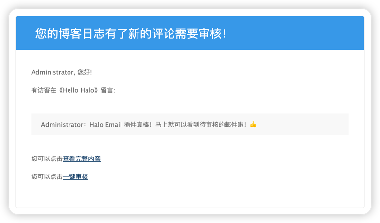

# halo-plugin-email

Email plugin for Halo2.0




## 功能

- [x] 新评论邮件通知
- [x] 为第三方插件提供邮件通知API
- [ ] 评论审核邮件通知
- [ ] 新回复邮件通知
- [ ] 文章审核通知
- [ ] 自定义通知模板

## 使用

1. Releases 下载最新版本
2. Halo 后台插件安装并启动
3. 进入 插件设置页面 配置邮件服务器信息
4. 调用接口测试连接(true为成功,每次修改配置都需要进行测试): `http://ip:port/apis/io.mvvm.halo.plugins.email/testConnection`

## 第三方插件

邮件插件为第三方插件提供了API，可以自定义邮件发送逻辑

1. 实现 PluginEmailOperator 接口

```java
@Getter
public class RootEmailPluginOperator implements PluginEmailOperator {

    private final PluginWrapper pluginWrapper;
    private final Set<ExtensionTemplateProcess> templateProcess = new CopyOnWriteArraySet<>();
    private final Set<TemplateLoader> templateLoader = new CopyOnWriteArraySet<>();
    private final Set<EmailTemplateOption> templateOptions;

    public RootEmailPluginOperator(PluginWrapper pluginWrapper) {
        this.pluginWrapper = pluginWrapper;
        templateProcess.add(new CommentExtensionTemplateProcess());
        templateLoader.add(new ClassPathTemplateLoader());
        templateOptions = Arrays.stream(EmailTemplateOptionEnum.values())
                .map(EmailTemplateOptionEnum::getOption)
                .collect(Collectors.toSet());
    }

}
```

2. 注册 & 卸载

```java
@Slf4j
@Component
public class EmailPlugin extends BasePlugin {

    public EmailPlugin(PluginWrapper wrapper) {
        super(wrapper);
    }

    @Override
    public void start() {
        EmailPluginManager.register(new RootEmailPluginOperator(getWrapper()));
    }

    @Override
    public void stop() {
        EmailPluginManager.unregister(getWrapper().getPluginId());
    }
}
```

3、发送邮件

```java
@Resource
private IEMailService mailService;
mailService.send(new EMailRequestPayload(EMallSendEndpoint.ExtensionAdd.name(), extension))
```

## 构建生产产物

```
./gradlew -x build
```

然后只需复制例如`build/libs/halo-plugin-email-1.0.0-alpha.2-plain.jar` 的 `jar` 包即可使用。